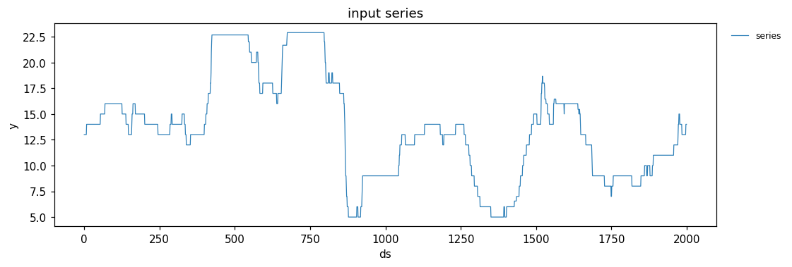
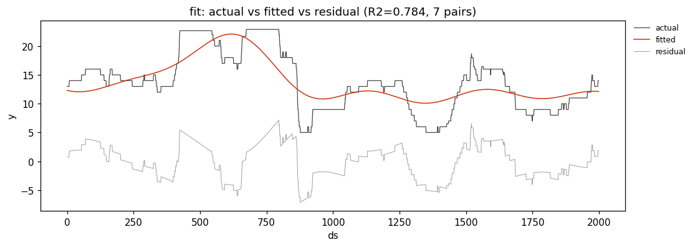
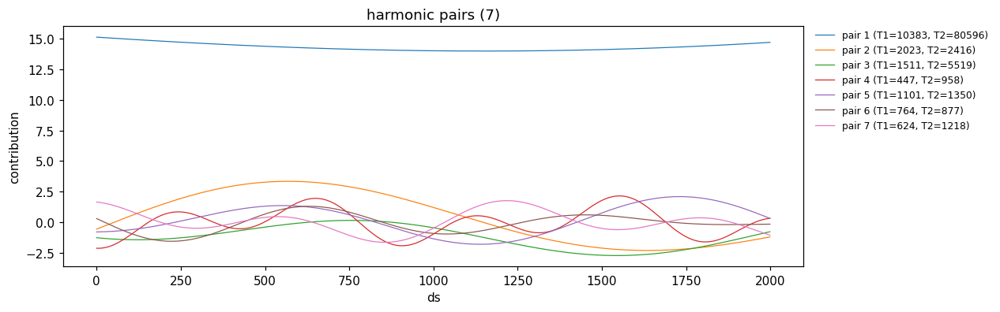
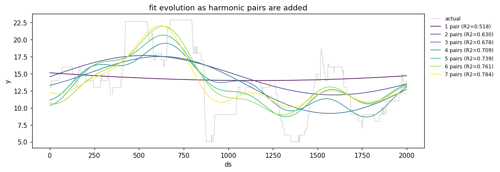
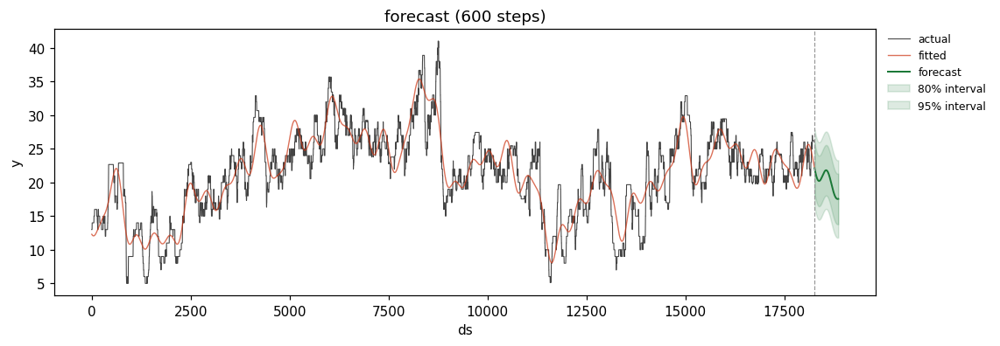
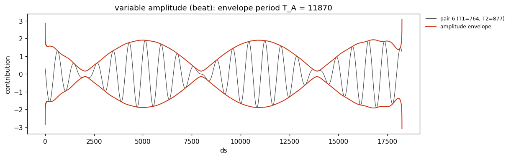
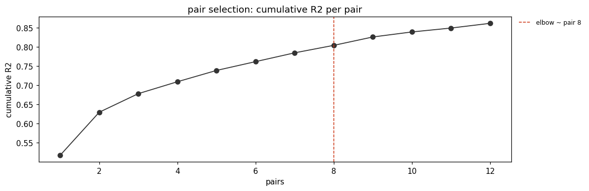
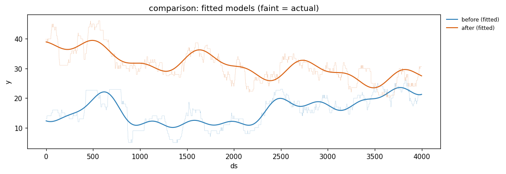

# Bayesian Harmonic Analysis

A Python library for decomposing, analyzing, and forecasting a time series as a sum of **harmonic
pairs** (Bayesian harmonic analysis). Fit any single `ds, y` series, read off its **trend / cycle /
grey-zone** structure, detect **variable-amplitude (beat)** components, and forecast forward with
intervals. sklearn-style: `HarmonicModel().fit(series)`, then `summary()`, `predict()`, `plot_*()`.

The method also supports a before/after comparison: fit two series and compare their harmonic
architecture. That is what it was originally published for (Markov, Marchev, Haralampiev, *Bayesian
Harmonic Analysis solving longitudinal statistical testing for differences of experimental time-series
data*), but the single-series workflow is the common case.

> The source paper PDFs are not redistributed in this repository. The full methodology is written up
> from them in `docs/knowledge/`, with citations in `docs/knowledge/06-glossary-and-sources.md`.

> Status: the `harmonix` library is implemented (`src/harmonix/`) with an sklearn-style
> `HarmonicModel` (fit / predict / summary / plot). The before/after difference test, the FFT suite,
> and the failed baselines are still on the roadmap. Start at `docs/knowledge/00-index.md`.

## Repository map

```
src/harmonix the library (HarmonicModel, Series, core, plotting)
data/        four example series (before_1/2, after_1/2) + ds,y templates
docs/
  guide.md   theory + how to use every function and method
  images/    figures (generated by make_readme_figures.py)
  knowledge/ the methodology spec and math (00-index.md)
examples/    demo.ipynb - end-to-end walkthrough
tests/       library tests (pytest tests/ -q)
```

## Documentation

- **[docs/guide.md](docs/guide.md)** - theory, how to use every function and method, with figures.
- **[examples/demo.ipynb](examples/demo.ipynb)** - runnable end-to-end walkthrough.
- **[docs/knowledge/](docs/knowledge/00-index.md)** - the methodology spec and the math.

## Reading order

1. `docs/guide.md` - start here: theory + how to use it
2. `docs/knowledge/00-index.md` - the method and the doc map
3. `docs/knowledge/01-methodology.md` - the pipeline and the equations
4. `docs/knowledge/07-qa-audit.md` - what the notebooks got right and wrong
5. `src/README.md` - the library design

## What the library does

Every figure below is a one-call method. All are produced by the library via
`python docs/make_readme_figures.py`.

`series.plot()` - the input, one series, two columns `ds, y`:



`model.plot_fit()` - actual vs the fitted sum of harmonic pairs, with the residual:



`model.plot_components()` - the individual harmonic pairs the fit is built from (legend omitted past
20 pairs; `plot_components(pairs=[1,3])` or `plot_pair(i)` for any subset):



`model.plot_evolution()` - the fit building up as pairs are added, R2 rising from one pair to all:



`model.plot_forecast(h, level=[80,95])` - the harmonics continued forward with prediction intervals:



`model.plot_variable_amplitude()` - the most beat-like pair with its amplitude envelope:



`model.plot_pair_selection()` - cumulative R2 per pair. The bare BIC default keeps going (and overfits,
see the audit), so cap with `max_pairs` or stop on `min_r2_gain` near the elbow:



`m1.compare_to(m2)` (or `plot_comparison([m1, m2])`) - overlay two fitted series, e.g. before vs after:



## Library usage

Install editable, then fit / predict / summary / plot (sklearn-style). See `src/README.md`.

```
pip install -e .          # or: pip install -e .[viz,excel]
```

### Input data shape

One series at a time, two columns only: `ds` (integer step or regular datetime) and `y` (the value).
No series id, no group column. Loadable from JSON, CSV, Excel, or a DataFrame.

```
ds,y
0,13.0
1,13.0
2,14.0
```

Templates: `data/template.json`, `data/template.csv`. Full contract:
`docs/knowledge/08-input-schema.md`. The bundled example data is four anonymized files
(`before_1.json`, `before_2.json`, `after_1.json`, `after_2.json`), one series each.

### Fit, summarize, predict, plot

```python
from harmonix import HarmonicModel, Series

series = Series.from_json("data/before_1.json")   # or from_csv / from_excel / from_dataframe

model = HarmonicModel(min_r2_gain=0.02, solver="lstsq").fit(series)   # stop on R2 gain

model.summary()                    # metrics (R2/RMSE/MAE/MAPE/BIC/AIC) + per-pair analyze table
fc = model.predict(100, level=[80, 95])   # forecast forward, optional prediction intervals

model.analyze()                    # per-pair table (amplitudes, phases, conditions, classes)
model.count_components()           # trend / cycle / noise counts
model.variable_amplitude_pairs()   # beat pairs split into envelope + carrier

# every figure is a one-call method (needs the [viz] extra):
model.plot_series(); model.plot_fit(); model.plot_components(); model.plot_residuals()
model.plot_forecast(100, level=[80, 95]); model.plot_variable_amplitude(); model.plot_pair_selection()
```

**Pair count:** the recommended control is `min_r2_gain` (stop once a pair adds less than that fraction
of variance, e.g. `0.02`). The faithful default reproduces the notebook's BIC stop, which overfits on
clean signals (`docs/knowledge/07-qa-audit.md`); `max_pairs=N` gives an exact cap. `solver="lstsq"` is
the stable solve. Full how-to and theory: [docs/guide.md](docs/guide.md).

### Comparing two series (e.g. before/after)

Fit each series and compare. The visual overlay and component counts are available now; a single-call
`BeforeAfterComparison` with a formal difference test is on the roadmap.

```python
mb = HarmonicModel().fit(Series.from_json("data/before_1.json"))
ma = HarmonicModel().fit(Series.from_json("data/after_1.json"))
mb.compare_to(ma, labels=["before", "after"])   # overlay fitted models
mb.count_components(); ma.count_components()       # structure side by side
```

### Optional plotting

Plotting is off by default and requires the `[viz]` extra. Nothing in the compute path imports a
plotting library.

```python
model.plot()        # fitted vs actual and per-harmonic components
fc.plot()           # forecast with intervals
```

## Running the QA tests

```
pip install numpy scipy pytest
pytest tests/ -q
```

The suite copies the core notebook functions into `tests/harmonics_ref.py` and pins their behavior. It
documents two real issues the library must fix: the BIC stopping rule overfits on low-noise signals,
and the single-pass period search is multimodal. See `docs/knowledge/07-qa-audit.md`.

## Where the math lives

Everything is in `docs/knowledge/`, with equations and sources. The external method foundation is
Bretthorst's Bayesian spectrum analysis and Schwarz's BIC; see
`docs/knowledge/06-glossary-and-sources.md`.
